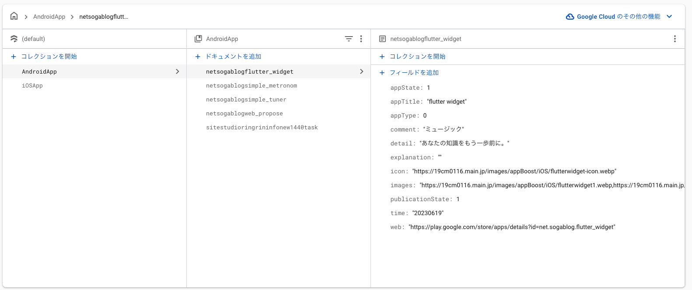
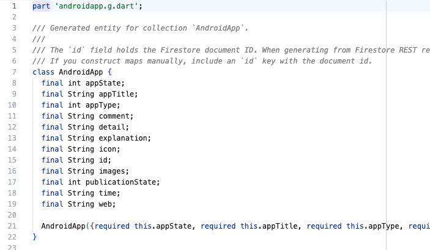

# firestore_entity_gen
||||
|---|---|---|
||👉||
Key points (must read)
- Users normally do not write model classes by hand. The intended workflow is to use bin/gen_from_firestore.dart to infer types from Firestore (REST) and auto-generate them.
- The library-side @FirestoreEntity (source_gen) support is an auxiliary feature. The recommended workflow is generation via the CLI.

Quickstart (gcloud-based)

1) Get dependencies

```bash
fvm dart pub get
```

2) Prepare and authenticate gcloud

Example using Homebrew on macOS:

```bash
brew install --cask gcloud
```

Initialize gcloud (choose account and project):

```bash
gcloud init
```

Issue Application Default Credentials (token used by the CLI):

```bash
gcloud auth application-default login
```

If needed, set a quota project:

```bash
gcloud auth application-default set-quota-project [YOUR_PROJECT_ID]
```

Verify token retrieval to confirm everything works:

```bash
gcloud auth application-default print-access-token
```

If a token is shown you can use the CLI to generate code:

```bash
# In your project directory
fvm dart pub add firestore_entity_gen
fvm dart run firestore_entity_gen:gen_from_firestore -p [YOUR_PROJECT_ID] -c [Collection name] -o [output base e.g.: example/lib/generated]
```

Notes (for developers)
- If a developer checks out the repository and wants to run it directly, call the script from the repo root pointing to bin:

```bash
# From the repository root
fvm dart run bin/gen_from_firestore.dart -p YOUR_PROJECT_ID -c Collection -o example/lib/generated
```

Note: If gcloud auth application-default login fails, check network connectivity, gcloud version, and existing authentication state (gcloud auth list).

---

About the id field

- Generated classes include an id field. This represents the Firestore document ID (extracted from the REST response's name field).
- The CLI parses the name field from each Firestore REST document, extracts the id, and injects an id key into the parsed map at generation time. Therefore the generated _$ClassFromFirestore and utilities can refer to map['id'].
- If you manually construct a map and pass it to a fromFirestore-equivalent function, always include the id key (for example: {'id': '<docId>', 'name': '...'}) .

---

要点（必読）
- 利用者は通常モデルクラスを手で書きません。`bin/gen_from_firestore.dart` を使い、Firestore（REST）から型推論して自動生成するワークフローを想定しています。
- ライブラリ側の `@FirestoreEntity`（source_gen）サポートは補助機能です。推奨ワークフローは CLI による生成です。

クイックスタート (gcloud ベース)

1) 依存を取得

```bash
fvm dart pub get
```

2) gcloud の準備と認証

macOS では Homebrew を使った例:

```bash
brew install --cask gcloud
```

gcloud 初期化 (アカウントとプロジェクトを選択):

```bash
gcloud init
```

Application Default Credentials を発行 (CLI が利用するトークン):

```bash
gcloud auth application-default login
```

必要に応じてクォータプロジェクトを設定:

```bash
gcloud auth application-default set-quota-project [YOUR_PROJECT_ID]
```

トークン取得を確認して動作を検証:

```bash
gcloud auth application-default print-access-token
```

トークンが表示されれば CLI を使って生成できます:

```bash
# プロジェクトディレクトリで
fvm dart pub add firestore_entity_gen
fvm dart run firestore_entity_gen:gen_from_firestore -p [YOUR_PROJECT_ID] -c [Collection name] -o [出力バス 例：example/lib/generated]
```

備考（開発者向け）
- 開発者がリポジトリをチェックアウトして直接実行する場合は、ルートから bin を指定して呼べます:

```bash
# リポジトリのルートで
fvm dart run bin/gen_from_firestore.dart -p YOUR_PROJECT_ID -c Collection -o example/lib/generated
```

注: `gcloud auth application-default login` が失敗する場合は、ネットワークや gcloud のバージョン、既存の認証状態（`gcloud auth list`）を確認してください。

---

### `id` フィールドについて

- 生成されるクラスには `id` フィールドが含まれます。これは Firestore のドキュメントID（REST レスポンスの `name` フィールドから抽出）を表します。
- CLI は Firestore REST の各ドキュメントから `name` をパースして `id` を抽出し、生成時にパース済みマップへ `id` キーを注入します。したがって、生成された `_$ClassFromFirestore` やユーティリティは `map['id']` を参照できます。
- 手動でマップを作成して `fromFirestore` 相当の関数に渡す場合は、必ず `id` キーを含めてください（例: `{'id': '<docId>', 'name': '...'}`）。
